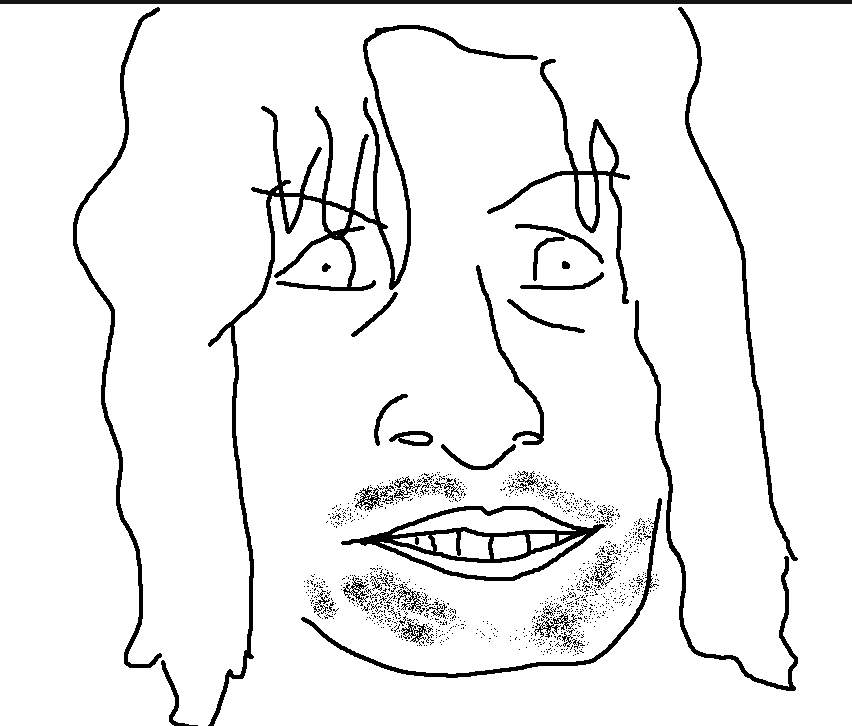
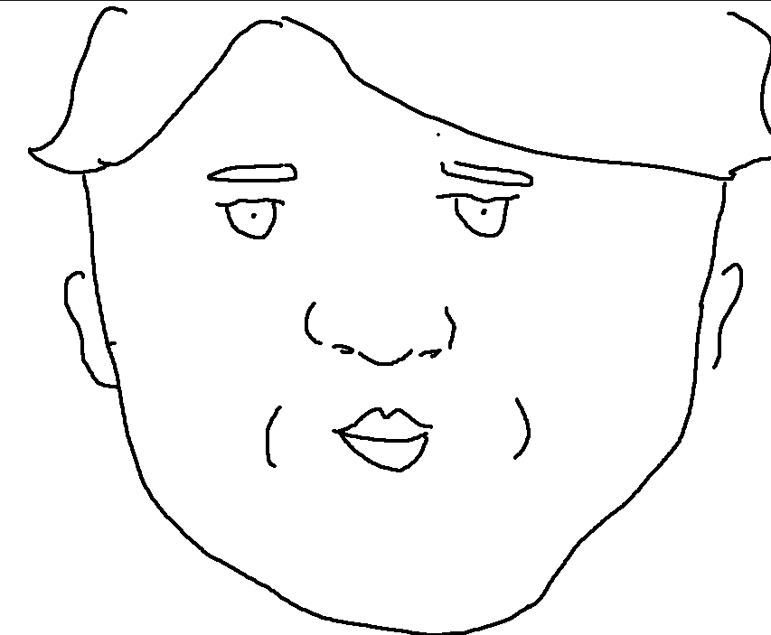
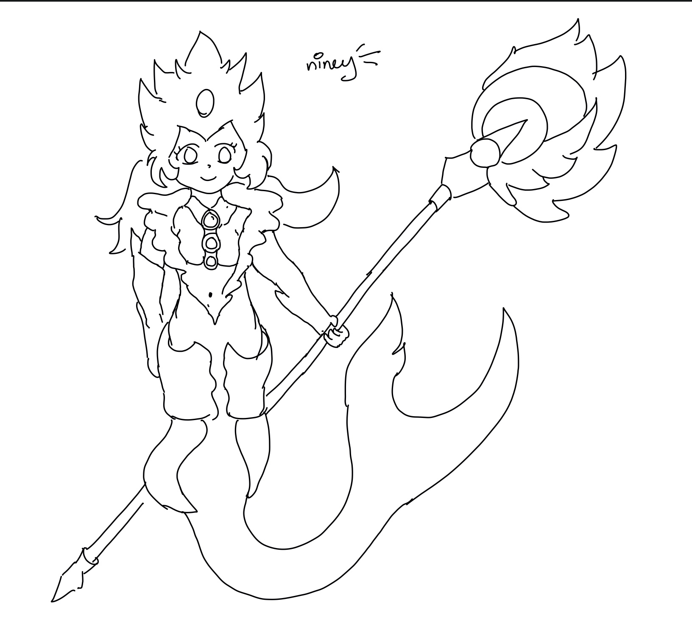
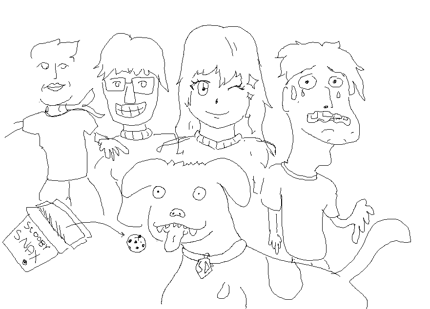
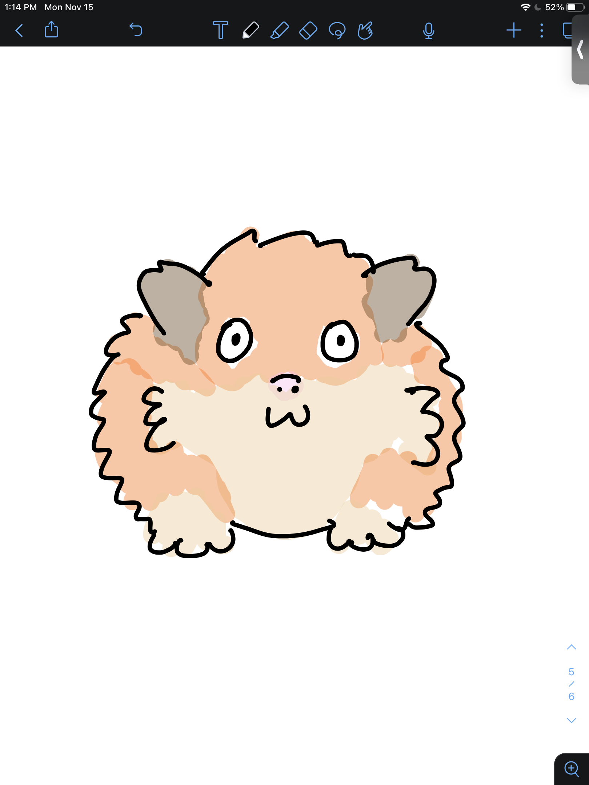
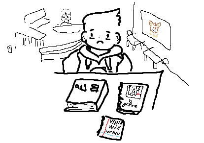

<link rel=stylesheet type="text/css" href="assets/css/art.css">

I've wanted to be good at drawing as long as I can remember.
Funnily enough, this has never translated into me actually putting the
time into seriously learning how to draw. However, I still love to doodle
and sketch, and here are some prolific examples of my clearly untapped talent:

### Aragorn (MS Paint, 2023)

### Aragorn on the cover of the DVD of LOTR (MS Paint, 2023)

### Frodo (MS Paint, 2023).

I was trying to draw the expression on his face that he makes in all three movies, all the time. I think I got it.

### An interpretation of the Starbucks bee cake pop (MS Paint, 2023)

I don't know why I drew this.

### Nami from League of Legends (Notability, 2022)

I remember I was quarantining because my roommate had COVID when I drew this.

### The Scooby Squad (MS Paint, 2021)

I am almost 100% sure that this was the thing that impressed my girlfriend enough to start dating me.

### A guinea pig (Notability, 2021)

Back when I was a TA for [CSE 142](https://courses.cs.washington.edu/courses/cse142/22wi/assessments/a8.html),
we had a critters assignment where students would
write classes that simulated behavior of various critters. I drew
this to motivate my esteemed group of TAs to grade the assignment.

### My friend [Sasha](https://turtleshell.me/) at [Cafe Solstice](https://www.instagram.com/cafesolstice/) (MS Paint, 2020)

In pre-pandemic 2020, Sasha and I were both really miserable all the time, for different reasons.
We would go to Cafe Solstice and just sulk together. I drew this to commemorate our shared misery.

### Shinji from Neon Genesis Evangelion (MS Paint, 2020)

I was really into Evangelion for a while -- I don't really know why.
I loved the visuals and the mechs, but I couldn't (and still can't) understand what's going on.
