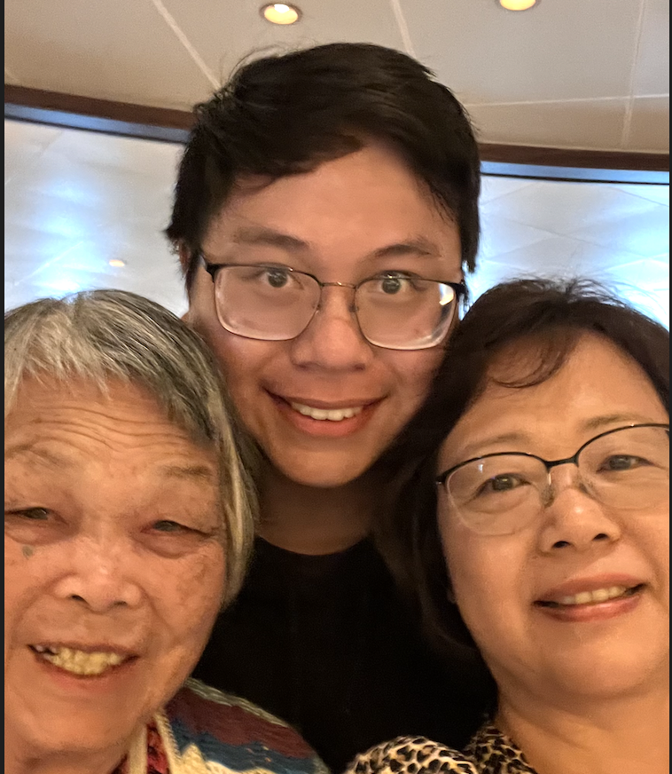

---
# Feel free to add content and custom Front Matter to this file.  # To modify the layout, see https://jekyllrb.com/docs/themes/#overriding-theme-defaults

layout: home
---

<!-- import css -->
<link rel="stylesheet" type="text/css" href="assets/css/style.css">

<link rel="icon" href="./favicon.png" type="image/x-icon">

<!-- profile picture -->

<!-- h1 with id of title -->
<h1 id="title">Andrew Cheung <a href="https://en.pronouns.page/he">(he/him)</a></h1>

 

I'm Andrew, an incoming PhD student at UC San Diego's [CSE department](https://cse.ucsd.edu/).
I'll be working in the [Programming Systems](https://cseweb.ucsd.edu/groups/progsys/) group!

Before UCSD, I got my master's and bachelor's at the University of Washington's
[Paul G. Allen School of Computer Science & Engineering](https://www.cs.washington.edu/).
I was advised by
[Zachary Tatlock](https://ztatlock.net) and mentored by
[Gus Smith](https://justg.us/)
in the [PLSE](https://uwplse.org/) lab!

_Are you a UCSD undergrad/master's student interested in research? Let's chat -- I don't bite!_

# Research

**In general, my research motivation is to make it easier to write tricky code[^1].**

Right now, I'm at [Synopsys](https://www.synopsys.com/), where I'm exploring
this goal in the context of hardware design. Specifically, I'm looking at
how to use [equality saturation](https://docs.rs/egg/latest/egg/tutorials/_01_background/index.html) to make maintaining hardware tools easier.

At UW, I worked with Zach, Gus, and many others on projects which worked
toward the same goal. Here are some of them:

[^1]: I stole this line from my old advisor, [Zachary Tatlock](https://ztatlock.net).

- [Lakeroad](https://github.com/uwsampl/lakeroad) ([ASPLOS 2024](https://arxiv.org/abs/2401.16526)) is a hardware compilation tool which
  uses program synthesis to compile high-level hardware snippets to
  FPGA primitives.

- [Cookie](./assets/cookie-paper.pdf)
  ([ICFP 2023](https://www.youtube.com/live/bjJU1vP1vVI?si=-3PuswxQ-ODEIMgr&t=28448))
  is an evaluation framework
  which rigorously tests FPGA compilation tools on their ability to
  technology map their designs. This won first place at ICFP's Student Research Competition!

- [Gator](https://github.com/ninehusky/gator) was my master's thesis project.
  It was a Lakeroad offshoot which aimed to use solvers to create
  _correct-by-construction_ hardware compilers.
  I gave a talk on this work [here](./assets/02-14-2024-gator-talk.pdf).
  I don't think I actually got it to work, but I learned a lot about program synthesis!

- [3LA](https://arxiv.org/abs/2203.00218) ([TODAES 2023](https://arxiv.org/abs/2203.00218))
  is a project which makes it easier for developers
  to perform end-to-end evaluations of their accelerators.

Alongside these projects, I also interned at Intel Labs in 2023, where
I used formal verification tools to verify the correctness
of part of an accelerator.

# Other Stuff

In addition to research, I have a strong passion for teaching and CS education.
Back at UW, I was with the TA program for the intro sequence for 5 years!
One of my favorite jobs was being the TA Coordinator for the intro sequence,
where I led over 100 TAs and interviewed, hired, and trained our quarterly cohort of new TAs
alongside the amazing [Chloe Fong](https://www.linkedin.com/in/chloe-fong/).

Some highlights:

- [Here's](./assets/photos/thefriends.jpeg) a picture of us from Spring 2023 (I'm in the middle wearing the turtleneck)!

- [Here's](https://www.youtube.com/watch?v=4BVsKkF2FUE) a documentary by Northeastern University's Center for Inclusive Computing that highlights the world-class TA program that I'm very lucky to have been a part of.

When I'm not teaching or doing research, I like to
improve my mediocre abilities as an amateur chef, programmer, and artist.
Recently, I've discovered a love for running and lifting heavy things.

I also enjoy playing Dota, which is kind
of like lifting four really heavy things at once.

 
